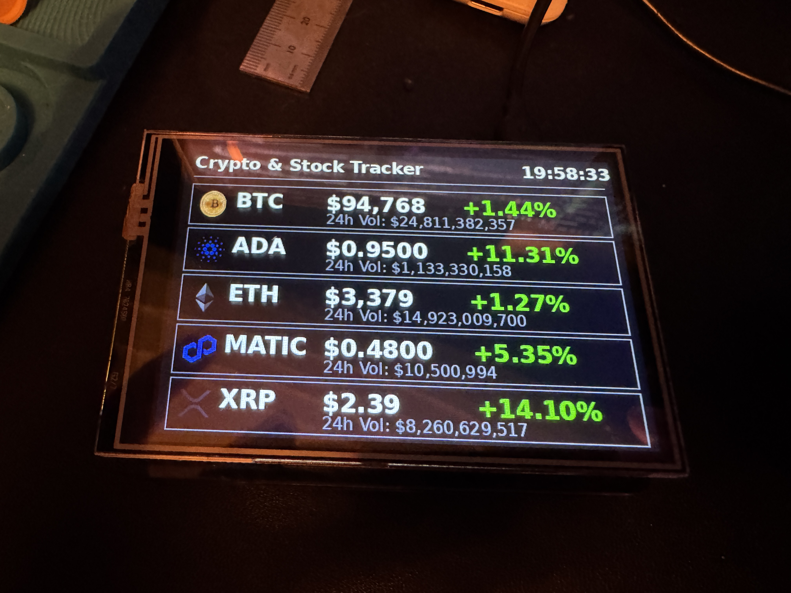

# Crypto-Pi

This is a project that uses the 3.5" Raspberry Pi touchscreen display and a RPi 3+ to query CoinGecko and display the prices, changes, and volume of the coins on the screen. I had the screen and the pi laying around, some time during the holidays, and I wanted to learn more about LCD drawing/graphics so - this was a stupid fun little project I played with for the day.



## How it Works

It uses PIL (Pillow) to the LCD operations (draw, clear, etc.) and [CoinGecko](https://docs.coingecko.com/v3.0.1/reference/introduction) (Free API version) to query every 5 minutes are retrieve the relevant data. 

## XPT2046 3.5"

Firstly, I know it's a touchscreen, but I didn't program it to be one. I really don't care about that (right now). Secondly, getting it to work without a GUI was a bit of a PINA. I tried many things and there were many edge cases (i.e., PyGame does not have FB support, overlay and driver issues, etc.). So, below is my `/boot/firmware/config.txt` that I got to work. Arguably, the fact that I used Raspbian is the primary issue and I should have gone with a default debian build to mitigate many of my issues.

```text
# Core settings
dtparam=audio=on
camera_auto_detect=1
display_auto_detect=1
dtoverlay=vc4-kms-v3d
max_framebuffers=2
arm_64bit=1

# SPI and Display Settings
dtparam=spi=on
dtoverlay=piscreen,speed=16000000,rotate=270,width=480,height=320,fps=30,txbuflen=32768

# Ensure framebuffer is enabled
ignore_lcd=1
```