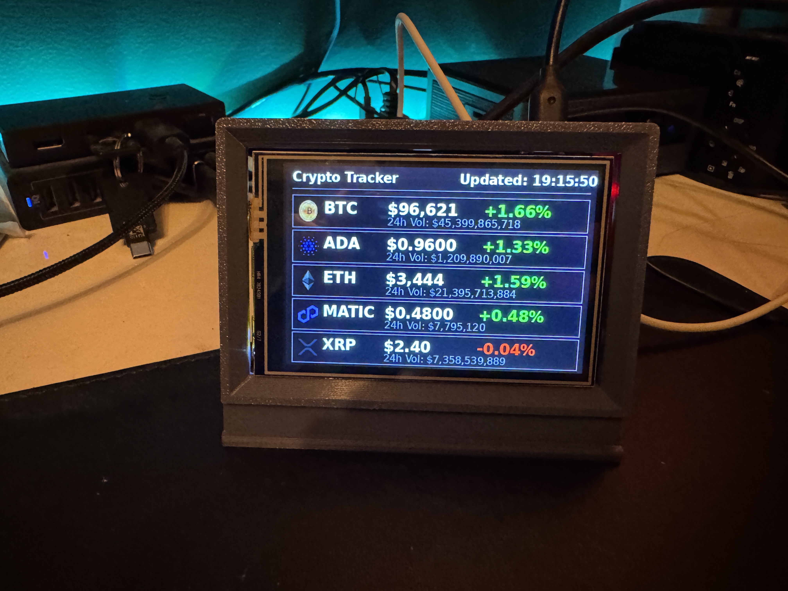

# Crypto-Pi

This is a project that uses the 3.5" Raspberry Pi touchscreen display and a RPi 3+ to query CoinGecko and display the prices, changes, and volume of the coins on the screen. I had the screen and the pi laying around, some time during the holidays, and I wanted to learn more about LCD drawing/graphics so - this was a stupid fun little project I played with for the day.

## How it Works

It uses PIL (Pillow) to the LCD operations (draw, clear, etc.) and [CoinGecko](https://docs.coingecko.com/v3.0.1/reference/introduction) (Free API version) to query every 5 minutes are retrieve the relevant data. 